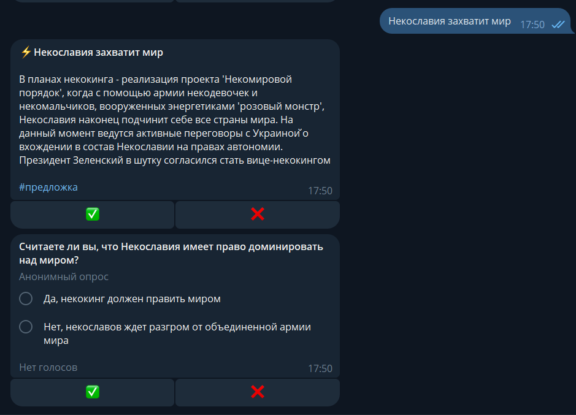

# Telegram bot for managing news channel using AI

This is a simple telegram bot that allows you to generate posts in a news channel of a given topic using AI. The bot
can generate news, polls, and also respond to comments on them. Try the bot: https://t.me/nekoslovach_bot. Channel:
https://t.me/nekoslovach

### Features

* Generating using AI news from a picture, text or picture with a caption. Just send any message to the bot in private
  messages. The generated news consists of a title and text. After generation, the user can post the news to the channel
  using the check mark button
* Generating a poll for each news item. The poll consists of a question and two answer options
* Automatic posting to the channel every N hours. The topic of the news and the poll are selected randomly from the list
  of hashtags
* Generating responses to comments in a channel. Unfortunately, the bot cannot support a meaningful dialogue

### Used technology

* Python 3.12
* Aiogram 3.x (Telegram Bot framework)
* Docker (containerization)
* OpenAI API (to access LLM models)
* FastAPI (web server for webhook)

### Installation

* Edit file `example.env` and fill it with your data, then rename it to `.env`. This file contains all the bot settings
* Edit file `prompts.py` and fill it with your data. This file contains templates of all prompts that are sent via the
  OpenAI API
* Run docker container with commands:  
  `docker build -t <image_name> .`  
  `docker run <image_name>`
